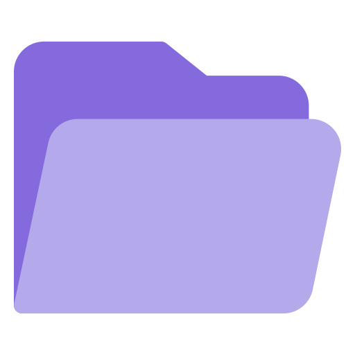

# Calima

  
  
<em>Tu nube personal</em>

**Calima** es una aplicación web de almacenamiento en la nube personal. Sube, organiza y comparte tus archivos desde cualquier dispositivo, con un diseño oscuro minimalista inspirado en Material You.

---

## Características

- **Autenticación con Google** (Supabase Auth + OAuth 2.0).
- **Gestión de archivos**: sube, abre y elimina archivos con un solo clic.
- **Carpetas**: crea y navega por carpetas anidadas con breadcrumb interactivo.
- **Drag & drop global**: arrastra archivos a cualquier parte de la pantalla para subirlos.
- **Subida múltiple** con barra de progreso en tiempo real y estado por archivo.
- **Enlaces firmados** para abrir archivos de forma segura (URLs temporales de 1 hora).
- **Diseño responsive** con layout adaptativo para móvil y escritorio.
- **Tema oscuro Material You** con acentos morados, transiciones suaves y microanimaciones.
- **Snackbars** de feedback para cada acción (subida, borrado, errores).
- **Scrollbar oculta** y estética limpia sin distracciones.

---

## Stack

| Capa | Tecnología |
|------|------------|
| Frontend | HTML5 + CSS3 + JavaScript (vanilla) |
| Backend / Storage | [Supabase](https://supabase.com/) (Storage + Auth) |
| Autenticación | Google OAuth 2.0 (vía Supabase Auth) |
| Tipografía | Google Fonts (Varela Round) |
| Iconografía | Material Icons |

Sin frameworks, sin bundler, sin build step. Se abre directamente en el navegador.
